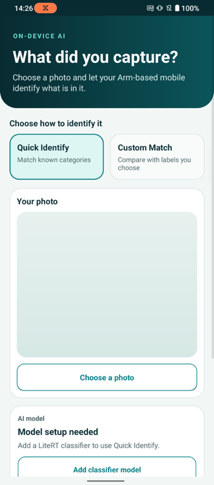
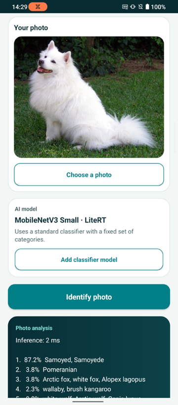
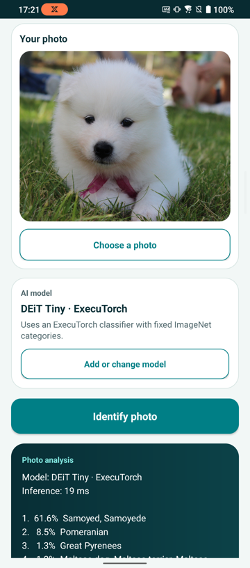
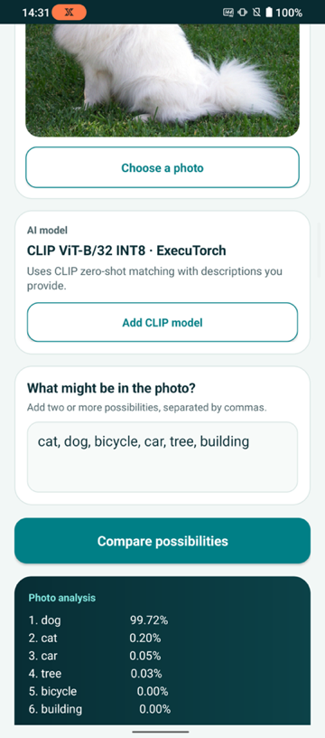

# Photo Insight Android application

This example application accompanies the [Arm Learning Path for running image classification models from the Arm AI Portal](https://learn.arm.com/learning-paths/mobile-graphics-and-gaming/ai-portal-mobile-image-classification). It is intended for learning how models run on devices and is not a reference production application. It is provided under the [Arm Education End User License Agreement](LICENSE.md).

This Android application runs Arm-optimized image models locally on an Arm64 phone or emulator. It includes three supplied adapters:

- `LiteRtImageClassificationAdapter` provides **LiteRT Quick Identify**, using a fixed-label ImageNet classifier with LiteRT and XNNPACK. Several models can use this adapter.
- `ExecuTorchImageClassificationAdapter` provides **ExecuTorch Quick Identify**, using a fixed-label ImageNet classifier with ExecuTorch and XNNPACK. Several models can use this adapter.
- `ExecuTorchClipAdapter` provides **ExecuTorch CLIP Custom Match**, using CLIP with ExecuTorch and XNNPACK to compare a photo with descriptions entered by the user.

The application imports model binaries at run time, so the model files are not stored in the Android application package (APK).

## Application views

<p align="center">
  
  
  
  
</p>

The application supports fixed-label classification with LiteRT or ExecuTorch, and custom image-text matching with ExecuTorch CLIP.

## Requirements

- Android Studio with Android SDK 35
- Java 17, supplied by Android Studio
- An Arm64 Android device running Android 9, API 28, or later
- One supported or registered model file downloaded from the Arm AI Portal

## Supported launch models

The model registry uses the filename to select one of the three supplied adapters. The adapter then validates the model and handles its controls, preprocessing, runtime calls, and result formatting.

| Model | Runtime | Import this file |
| --- | --- | --- |
| [DEiT Tiny LiteRT](https://huggingface.co/Arm/deit-tiny-int8-litert) | LiteRT | `facebook__deit-tiny-patch16-224_litert_optimized.tflite` |
| [MobileNetV3 Small LiteRT](https://huggingface.co/Arm/mobilenet-v3-small-int8-litert) | LiteRT | `mobilenet_v3_small_android_litert_optimized.tflite` |
| [Swin Tiny LiteRT](https://huggingface.co/Arm/swin-tiny-int8-litert) | LiteRT | `microsoft__swin-tiny-patch4-window7-224_android_litert_optimized.tflite` |
| [timm ViT LiteRT](https://huggingface.co/Arm/vit-base-timm-int8-litert) | LiteRT | `timm__vit_base_patch16_224.augreg_in21k_ft_in1k_android_litert_optimized.tflite` |
| [DEiT Tiny ExecuTorch](https://huggingface.co/Arm/deit-tiny-int8-xnnpack-executorch) | ExecuTorch | `deit_raspberry_executorch_optimized.pte` |
| [GoogLeNet ExecuTorch](https://huggingface.co/Arm/googlenet-int8-xnnpack-executorch-raspberrypi5) | ExecuTorch | `googlenet_raspberry_executorch_optimized.pte` |
| [MobileNetV3 Small ExecuTorch](https://huggingface.co/Arm/mobilenet-v3-small-int8-xnnpack-executorch) | ExecuTorch | `mobilenet-v3-small-int8-executorch.pte` |
| [ResNet-18 ExecuTorch](https://huggingface.co/Arm/resnet-18-int8-xnnpack-executorch) | ExecuTorch | `resnet-18_raspberry_executorch_optimized.pte` |
| [ResNet-50 ExecuTorch](https://huggingface.co/Arm/resnet-50-int8-xnnpack-executorch) | ExecuTorch | `resnet-50_raspberry_executorch_optimized.pte` |
| [ShuffleNet V2 x1.0 ExecuTorch](https://huggingface.co/Arm/shufflenet-v2-x1-0-int8-xnnpack-executorch) | ExecuTorch | `shufflenet_v2_x1_0_raspberry_executorch_optimized.pte` |
| [SqueezeNet 1.1 ExecuTorch](https://huggingface.co/Arm/squeezenet-1-1-int8-xnnpack-executorch) | ExecuTorch | `squeezenet_1_1_raspberry_executorch_optimized.pte` |
| [Swin Tiny ExecuTorch](https://huggingface.co/Arm/swin-tiny-int8-xnnpack-executorch) | ExecuTorch | `swin_tiny_dynamic_raspberry_executorch_optimized.pte` |
| [ViT Base ExecuTorch](https://huggingface.co/Arm/vit-base-int8-xnnpack-executorch) | ExecuTorch | `google__vit-base-patch16-224_raspberry_executorch_optimized.pte` |
| [CLIP ViT-B/32 ExecuTorch](https://huggingface.co/Arm/clip-vit-base-patch32-int8-xnnpack-executorch) | ExecuTorch | `clip-vit-base-patch32-int8-executorch.pte` |

## Download a model

Create a Python virtual environment and install the Hugging Face Hub package:

On macOS or Linux:

```bash
python3 -m venv .hf-venv
source .hf-venv/bin/activate
python -m pip install --upgrade huggingface_hub
```

On Windows PowerShell:

```powershell
py -m venv .hf-venv
.\.hf-venv\Scripts\Activate.ps1
python -m pip install --upgrade huggingface_hub
```

Set the repository ID for one of the supported models, then run the included download script. The `--print-path` option returns the downloaded file path for later commands:

On macOS or Linux:

```bash
MODEL_ID="Arm/mobilenet-v3-small-int8-litert"
MODEL_FILE="$(python download_model.py \
  --repo-id "$MODEL_ID" \
  --print-path)"

printf 'Model file: %s\n' "$MODEL_FILE"
```

On Windows PowerShell:

```powershell
$MODEL_ID = "Arm/mobilenet-v3-small-int8-litert"
$MODEL_FILE = python download_model.py `
  --repo-id "$MODEL_ID" `
  --print-path

Write-Output "Model file: $MODEL_FILE"
```

For a supported model, the script downloads the registered `.tflite` or `.pte` file. MobileNetV3 Small ExecuTorch and CLIP both publish a file named `optimized.pte`, so the script gives those two files unique names when it downloads them. For another repository, it downloads the package and selects its only `.tflite` or `.pte` file. Use `--filename` if the repository contains more than one model file.

Copy the downloaded model to the Android **Downloads** directory through ADB:

```console
adb push "$MODEL_FILE" /sdcard/Download/
```

## Open and run the application

1. Clone or download this repository.
2. Open the repository root in Android Studio.
3. Wait for Gradle sync to finish.
4. Connect an Arm64 Android phone or start an Arm64 emulator.
5. Select the `app` configuration and run it.
6. Select **Add or change model** and choose the matching optimized file.
7. Select **Choose a photo**, then run **LiteRT Quick Identify**, **ExecuTorch Quick Identify**, or **ExecuTorch CLIP Custom Match**.

The application does not include a sample photo. Each user selects the image they want to analyze from the Android document picker.

The application stores the selected model in its private files directory. Clearing application data or uninstalling the application removes imported models.

## Register another compatible model

A model that matches an existing adapter's task, tensor contract, labels, and preprocessing can use that adapter after you add one `ModelDescriptor` to `CompatibleModelRegistry.java`.

Each descriptor records the filename, adapter, and preprocessing configuration together. For example, a LiteRT ImageNet classifier that uses the same preprocessing as MobileNetV3 Small can be registered with:

```java
new ModelDescriptor(
        "my-litert-classifier",
        "My LiteRT classifier",
        LiteRtImageClassificationAdapter.ID,
        "LiteRT",
        "my-classifier.tflite",
        LiteRtImageClassificationAdapter.PROFILE_IMAGENET_CROP_256
)
```

Add the descriptor to the list returned by `CompatibleModelRegistry.models()`, rebuild the APK, and import the model using its unchanged filename. This route reuses an existing adapter. It is appropriate only when the model package matches that adapter's complete input, output, label, and preprocessing contract.

If the model has the same task and tensor contract but needs different resizing, cropping, normalization, or input dimensions, add a preprocessing profile to the existing classifier and adapter. Reference the new profile from the descriptor. Create a separate adapter only when the model changes the inputs, outputs, callable methods, runtime, result decoding, or application controls.

## Extend the application

The application discovers modes through `AdapterRegistry.java`. The supplied adapters support LiteRT classification, ExecuTorch classification, and ExecuTorch CLIP matching. `GeneratedAdapterRegistry.java` is intentionally empty and provides a build-time extension point for a model package that does not fit those adapters.

As an optional extra, the `adapter-generation/` directory contains scripts and a coding-agent prompt for inspecting a complete model package and preparing another adapter. The current importer accepts one model binary for each registered model. Packages that need multiple model binaries need changes to the importer and adapter contracts. Generated Java code, layouts, resources, and runtime dependencies must be compiled into a new APK and tested on an Arm64 Android device.

## License

This project is provided under the [Arm Education End User License Agreement](LICENSE.md).
